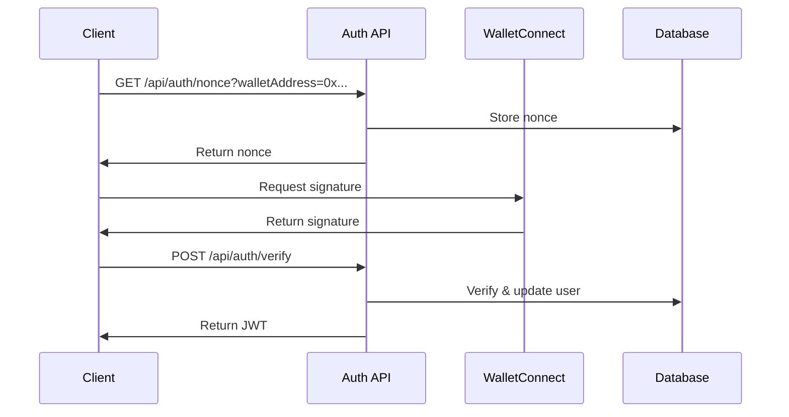

# Authentication API

## Overview

The authentication system uses Web3 wallet-based authentication with WalletConnect. The process follows these steps:

1. Request a nonce
2. Sign the nonce with the wallet
3. Verify the signature and issue a JWT
4. Use JWT for subsequent requests

## Endpoints

### 1. Get Nonce

Request a nonce for wallet signature.

```http
GET /api/auth/nonce
Query Parameters:
  walletAddress: string (required) - The wallet address requesting authentication

Response 200:
{
  "nonce": string,
  "expiresAt": string (ISO date)
}

Error 400:
{
  "error": "Invalid wallet address"
}
```

### 2. Verify Signature

Verify the signed nonce and issue a JWT.

```http
POST /api/auth/verify
Body:
{
  "walletAddress": string,
  "signature": string
}

Response 200:
{
  "token": string,
  "user": {
    "id": string,
    "walletAddress": string,
    "lastLogin": string (ISO date)
  }
}

Error 401:
{
  "error": "Invalid signature"
}
```

### 3. Refresh Token

Refresh an expired JWT.

```http
POST /api/auth/refresh
Headers:
  Authorization: Bearer <token>

Response 200:
{
  "token": string
}

Error 401:
{
  "error": "Invalid token"
}
```

## Authentication Flow



## Security Considerations

1. **Nonce Expiration**: Nonces expire after 5 minutes
2. **JWT Configuration**:
   - Expires in 24 hours
   - Contains user ID and wallet address
   - Signed with server's secret key
3. **Signature Verification**:
   - Verifies the wallet address matches the signature
   - Checks nonce hasn't been used before
   - Validates nonce hasn't expired

## Implementation Details

### JWT Payload Structure
```javascript
{
  "sub": "user-uuid",
  "wallet": "0x...",
  "iat": 1234567890,
  "exp": 1234567890
}
```

### Error Handling

All error responses follow this format:
```javascript
{
  "error": string,
  "details": string (optional),
  "code": string (optional)
}
```

## Rate Limiting

- 5 requests per minute for nonce generation
- 3 requests per minute for signature verification
- 10 requests per minute for token refresh

## Testing

Example curl commands for testing:

```bash
# Get nonce
curl -X GET "http://localhost:3000/api/auth/nonce?walletAddress=0x..."

# Verify signature
curl -X POST "http://localhost:3000/api/auth/verify" \
  -H "Content-Type: application/json" \
  -d '{"walletAddress":"0x...","signature":"0x..."}'

# Refresh token
curl -X POST "http://localhost:3000/api/auth/refresh" \
  -H "Authorization: Bearer ..."
```
