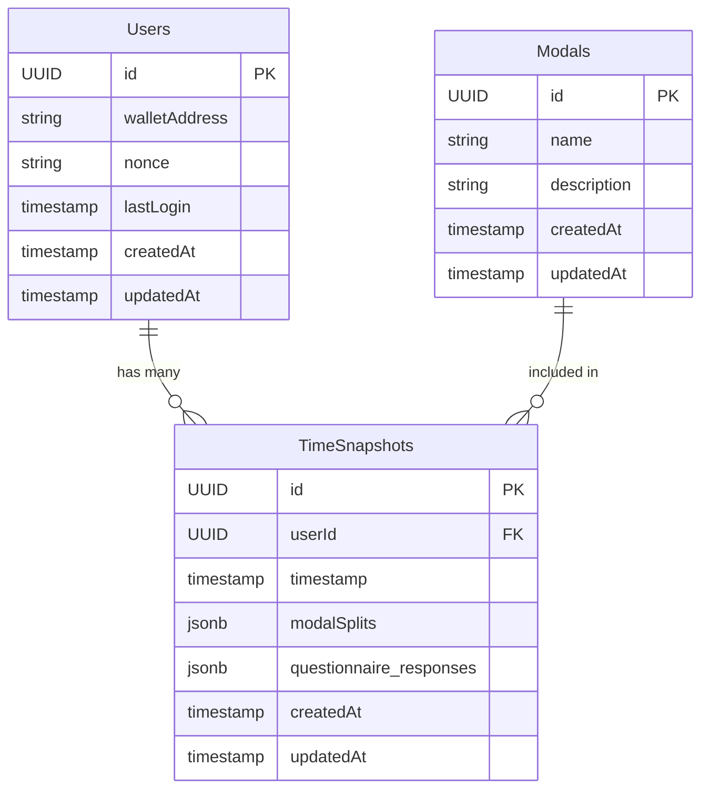

# Database Schema

## Overview

The Lagomo application uses PostgreSQL as its primary database. Here's a detailed breakdown of the database schema:

## Tables

### Users

```sql
CREATE TABLE Users (
    id UUID PRIMARY KEY DEFAULT uuid_generate_v4(),
    walletAddress VARCHAR(42) UNIQUE NOT NULL,
    nonce VARCHAR(255) NOT NULL,
    lastLogin TIMESTAMP,
    createdAt TIMESTAMP NOT NULL,
    updatedAt TIMESTAMP NOT NULL
);
```

### Modals (Time Categories)

```sql
CREATE TABLE Modals (
    id UUID PRIMARY KEY DEFAULT uuid_generate_v4(),
    name VARCHAR(255) NOT NULL UNIQUE,
    description TEXT,
    createdAt TIMESTAMP NOT NULL,
    updatedAt TIMESTAMP NOT NULL
);
```

### TimeSnapshots

```sql
CREATE TABLE TimeSnapshots (
    id UUID PRIMARY KEY DEFAULT uuid_generate_v4(),
    userId UUID NOT NULL REFERENCES Users(id),
    timestamp TIMESTAMP NOT NULL,
    modalSplits JSONB NOT NULL,
    questionnaire_responses JSONB,
    createdAt TIMESTAMP NOT NULL,
    updatedAt TIMESTAMP NOT NULL
);
```

## Relationships



## Indexes

```sql
-- Users table indexes
CREATE INDEX idx_users_wallet ON Users(walletAddress);

-- TimeSnapshots table indexes
CREATE INDEX idx_timesnapshots_user ON TimeSnapshots(userId);
CREATE INDEX idx_timesnapshots_timestamp ON TimeSnapshots(timestamp);
```

## Data Types

### modalSplits Format
```json
{
    "modal_id1": 25.5,
    "modal_id2": 74.5
    // Percentages must sum to 100
}
```

### questionnaire_responses Format
```json
{
    "question1": "response1",
    "question2": "response2",
    // Additional questions and responses
}
```

## Constraints

1. Wallet addresses must be unique
2. Modal splits must sum to 100%
3. Timestamps cannot be in the future
4. All referenced users must exist

## Migrations

Migrations are handled through Sequelize and can be found in the `/server/migrations` directory.

## Backup and Recovery

1. Regular backups are scheduled daily
2. Point-in-time recovery is enabled
3. Backup retention period is 30 days
