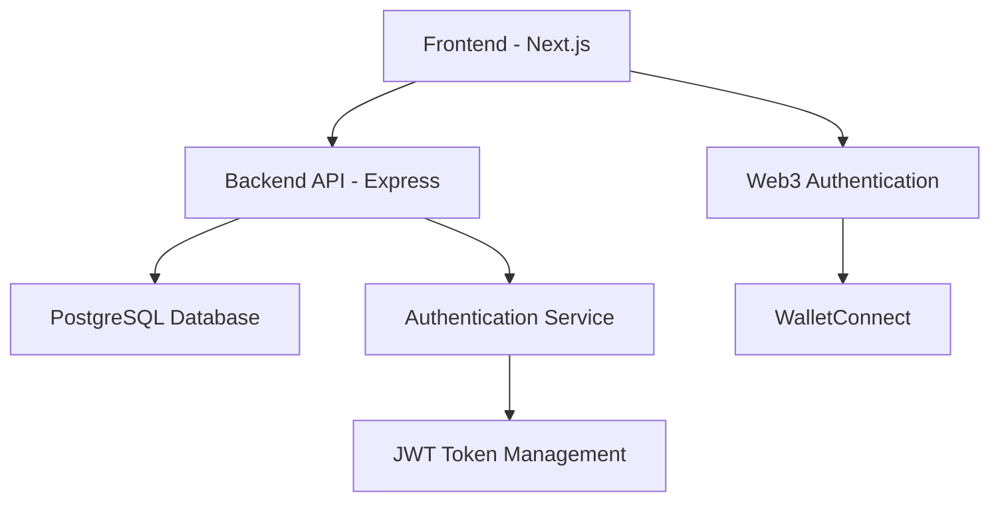
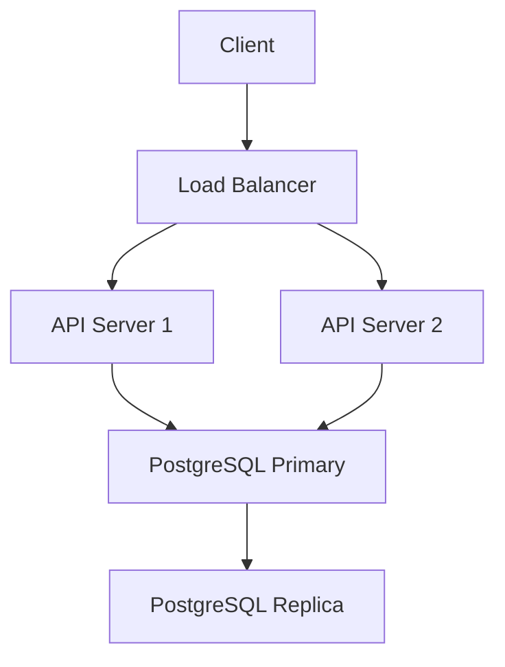

# System Overview

## Architecture Overview

Lagomo is a Web3-enabled time tracking application built with a modern stack:

## Core Components

### Frontend
- **Technology**: Next.js, React
- **Web3 Integration**: WalletConnect
- **State Management**: React Context/Hooks

### Backend
- **API Server**: Express.js
- **Database**: PostgreSQL
- **Authentication**: JWT + Web3 Wallet Signatures
- **ORM**: Sequelize

### Database Models
- Users
- Time Snapshots
- Modalities
- Questionnaire Responses

## Key Features

1. **Web3 Authentication**
   - WalletConnect integration
   - Signature-based authentication
   - JWT session management

2. **Time Tracking**
   - Modality-based time tracking
   - Questionnaire system
   - Historical data analysis

3. **Data Management**
   - Secure data storage
   - User data encryption
   - Backup and recovery

## Security Considerations

1. **Authentication**
   - Wallet signature verification
   - JWT token management
   - Session handling

2. **Data Protection**
   - Database encryption
   - Secure API endpoints
   - Rate limiting

3. **Web3 Security**
   - Message signing
   - Transaction verification
   - Network security

## Development Environment

- Local development setup
- Testing environment
- Staging environment
- Production environment

## Deployment Architecture

